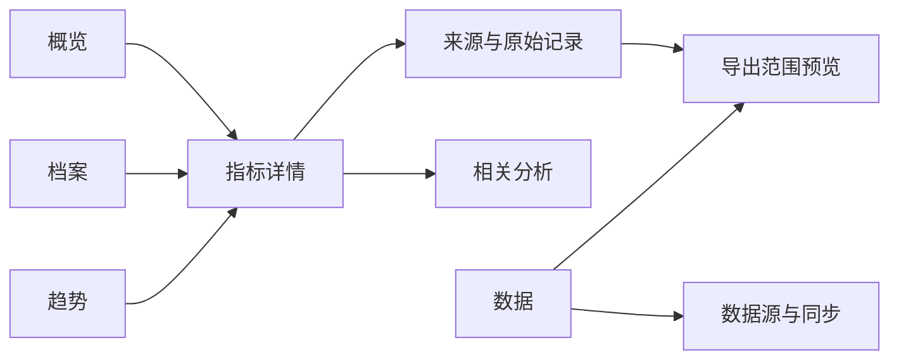

# App 设计与数据展示计划

更新：2026-10-06。状态：五入口、概览偏好、睡眠、事件线、领域回顾、设备趋势与文件导入已部分实施。完整设计尚未验收。本文是[健康数据中心实施计划](implementation-whoop-bevel.md)的组成部分，由 H13 维护。所有展示遵守[算法选型与证据](wellness-algorithms.md)，不会因为界面需要而生成未验证的分数。

设计目标是让用户先读懂数据，再查看解释，并能回到来源或导出。iPhone 用于日常浏览、导入和记录，网页用于长期对比、批量复核与导出。Android 后续沿用信息结构，采用各平台原生交互。

## 参考与取舍

| 参考 | 官方展示或说明 | 本项目采用的方式 |
| --- | --- | --- |
| 新版 Apple Health | Insights 聚合近期信息，Longevity 组织长期健康领域，结论可进一步查看。[D1] | 分开每日概览与长期趋势，按健康领域浏览。指标先展示摘要，再逐层展开 |
| WHOOP | 首页集中展示 Sleep、Recovery、Strain，点击进入详情，并有 My Day、My Plan 和可配置的 My Dashboard。[D2] | 首屏明确重点、日期和近期事件。用户可固定常看指标，详情解释数字组成 |
| Bevel | 官网展示健康领域界面，版本说明提供日事件时间线、收藏图表及重排或隐藏领域模块。[D3][D4] | 用一致的领域卡片连接睡眠、训练、营养与档案，支持时间线和布局偏好 |

Apple 参考以 2026 年 9 月官方公布的新设计为准。该公告将新版 Health 列为年内稍后提供，设计参考不等于确认所有用户已可用。WHOOP 的官方首页文章持续更新，本文按当前正文描述，不把文章最初发布日期当作当前界面版本。

下面的导航、尺寸和图表规则是 helpyourself 的设计决定，不是对三家产品的逐像素复刻。保留现有青绿色操作色，建立自己的图标、排版和组件。供应商截图只作参考，不作为应用素材。

## 导航与现有页面映射

手机采用五个主入口：概览、档案、趋势、分析、数据。默认打开概览，允许用户选择启动页。数据入口下固定显示“数据源”和“导出”，不把导出藏在设置深处。账户、服务器和外观设置从页面右上角进入。

| 主入口 | 用户任务 | 主要内容 |
| --- | --- | --- |
| 概览 | 了解最近有什么变化 | 日期、同步状态、收藏指标、最近事件、待复核材料 |
| 档案 | 查找记录和原件 | 全局搜索、健康领域、报告、测量、食物、训练、周期及手动日志 |
| 趋势 | 比较不同时间和来源 | 收藏图表、时间范围、指标对比、来源差异、覆盖情况 |
| 分析 | 理解数据及其限制 | 有依据的统计解释、历史分析、可选 AI 问答、研究功能入口 |
| 数据 | 管理健康档案的输入输出 | 来源授权、同步、字段覆盖、来源优先级、导出任务 |

现有 Reports 迁入档案的报告列表，Trends 保留并扩展。Health 中的指标浏览迁入档案，同步和授权迁入数据。Insights 保留为分析，Settings 迁入账户入口。迁移保留报告详情、趋势、审核、手动同步与服务器配置的可达性。[当前导航代码](../src/ios/HelpyourselfApp.swift)



## 主要页面

| 页面 | 首屏层级 | 核心交互与完成条件 |
| --- | --- | --- |
| 概览 | 日期与数据截止时间 → 收藏摘要 → 当日事件 → 待处理 | 卡片进入详情，日期切换不丢来源选择。摘要最多先显示四项，其余展开 |
| 档案 | 搜索 → 健康领域 → 最近记录 | 按类型、日期、来源和复核状态筛选。记录可返回原报告或设备记录 |
| 指标详情 | 数值与单位 → 时间与来源 → 图表 → 分项解释 → 记录列表 | 切换日／周／月／年／自选，选点查看精确值，查看依据或导出当前范围 |
| 趋势比较 | 指标与范围选择 → 对齐图表 → 差异与覆盖 | 最多先比较三项，不同单位使用对齐的小图。不能用无说明双轴制造相关性 |
| 数据源 | 各来源状态 → 支持字段 → 历史覆盖 → 同步操作 | 区分已连接、未授权、部分可读、失败。连接成功不等于所有类型已读取 |
| 来源对比 | 当前采用来源 → 重叠时段 → 两份记录 → 选择理由 | 对比后可修改某类型优先级，显示将重算的范围，原始数据仍保留 |
| 报告复核 | 原件与待确认字段 → 冲突或缺项 → 确认操作 | 手机逐字段定位原文，网页左右对照。确认值、原值和修订可分别查看 |
| 分析详情 | 结论 → 时间窗 → 支持数据 → 其他解释与限制 | 统计效应、区间和样本量可展开，引用跳回输入。AI 入口不覆盖图表 |
| 导出 | 范围与内容 → 格式 → 预览 → 任务状态 → 获取文件 | 区分当前筛选与全部档案。列出是否包含原件、修订及分析，失败可重试 |

概览不固定摆放三个恢复或能量仪表盘。默认优先使用有数据的睡眠时长、训练记录、已确认血检变化和收藏指标。缺数据时保留位置与原因，不用 0、空进度环或“健康正常”代替。

首次进入先展示“连接数据源”和“导入报告”。用户只导入报告也能使用档案与趋势，不强制拥有可穿戴设备。未开通的连接器显示支持范围，不展示硬件购买或订阅入口。

## 指标卡片与证据层级

卡片固定包含指标名、数值与单位、观测时间、简短趋势和来源摘要。仅在有效时展示比较值，写明比较窗口。卡片正文先用自然语言解释，算法名、版本及输入明细放在“查看依据”。

```text
睡眠                         10 月 6 日
7 小时 24 分                  昨夜主睡眠
比过去 28 个有效夜晚中位数少 18 分钟
[趋势缩略图，缺口留空]
Apple Health · 设备来源名称    查看详情 ›
```

以上数值仅为设计示例。原型的示例数据必须标为“演示数据”，不能混入用户真实记录。

三类结果使用文字标签区分：“来源测量”、“来源估计”、“本项目计算”。用户输入和 OCR 待复核另加状态。研究模型显示“研究功能”，其可计算状态不等于科学证据充分。设备原评分不套用本项目配色阈值，也不与自有算法连成同一条趋势。

详情的“查看依据”展示来源、采样协议、覆盖、单位转换、所用记录和算法版本。普通阅读路径不展示数据库字段或任务内部编号，复制技术诊断信息放在单独入口。

## 领域图表

| 数据 | 展示方式 | 必须保留的信息 |
| --- | --- | --- |
| 睡眠 | 跨午夜时间轴、分期带、时长柱图、规律性趋势 | 主睡眠与午睡、来源、缺分期状态、旅行和时区变化 |
| HRV 与生命体征 | 点线图加个人基线带 | RMSSD／SDNN、测量协议、基线窗口；基线带不称医学正常范围 |
| 训练 | 逐次负荷柱图、心率区间堆叠、动作组次表 | sRPE 与心率负荷分开，力量训练量保留动作语义 |
| 营养 | 摄入明细、目标进度条、HEI 分项 | 已确认分量、缺失营养素、记录完整度，未知不填零 |
| CGM | 时间序列、有效覆盖带、范围内时间 | 目标范围来源、餐食事件、长缺口；不自动评价食物好坏 |
| 血检 | 检测点与当次实验室参考区间 | 原单位、换算值、日期精度、原报告；不跨方法盲目连线 |
| 血压 | 同次收缩压／舒张压配对点 | 测量时间、设备与上下文；两值不当成独立日期 |
| 周期 | 日历与症状时间轴 | 已记录事件与预测分开，预测区间和来源明确 |
| 体重与长期健康 | 原始点加描述性趋势，各指标分面 | 来源变化、观测日期，研究年龄入口默认不置于概览 |
| 行为关联 | 原单位效应点与置信区间 | 两组样本数、窗口、调整因素、q 值及“相关不代表因果”说明 |

柱图默认从零起。折线图可采用适合数据范围的坐标，但必须显示刻度。无数据处断线，不平滑跨越缺口。来源或算法版本变化标在时间轴上，比较周期统一聚合方法。摘要中的“最近”不能掩盖数月前的血检日期。

图表支持轻点选点、拖动查看和明确的日期按钮。返回页面保留范围、来源、滚动位置。图表下提供可展开数据表与文字摘要，读屏和键盘用户可以访问同样的信息。

## 视觉与交互规范

采用系统字体、浅色与深色双主题，使用有边界的卡片和足够留白。图表区域使用稳定的实色背景，半透明材质仅用于导航和临时操作层。兼容现有 iOS 17 基线，新系统材质通过系统能力适配，不为外观单独提高最低系统版本。

| 元素 | 首版设计值 | 使用规则 |
| --- | --- | --- |
| 字体 | 正文 17 pt、辅助 13 pt、页标题 28–34 pt、主数值 28–36 pt | 跟随系统字号，关键时间、单位与来源不能因放大而消失 |
| 间距 | 4／8／12／16／24／32 | 页面边距 16–20 pt，卡片内边距 16 pt |
| 卡片 | 圆角 16–20 pt，轻分隔 | 同层卡片不叠加多重阴影，点击区域包含标题与内容 |
| 颜色 | 青绿操作色，睡眠紫、训练蓝、营养橙 | 领域颜色只帮助分类，不代表健康好坏；深色主题单独调色 |
| 状态 | 文字加图标，必要时使用强调色 | 红绿不能作为唯一信号，警示色不用于装饰 |
| 触控 | iOS 目标至少 44×44 pt | 关键操作无需只靠长按、滑动或颜色识别 |
| 动效 | 原生导航和可中断的短过渡 | 按下即时反馈，提交在释放时发生；不循环跳动生理分数 |

颜色值在高保真设计阶段以对比度检验定稿。正文目标对比度至少 4.5:1，关键图形至少 3:1，这是项目验收目标。支持系统大字号、VoiceOver、减少动态效果及降低透明度。减少动态效果时使用静态切换或短淡入，不隐藏反馈。

领域页的快捷新增只提供当前相关操作，例如食物记录或手动测量。来源选择、日期范围与筛选采用原生弹层，支持取消并保留先前状态。AI 生成建议先展示内容和依据，写入记录必须走可审阅的现有操作流程。

## 加载与异常状态

| 状态 | 用户看到什么 | 可执行操作 |
| --- | --- | --- |
| 首次无记录 | 功能用途、需要的数据、连接或导入入口 | 连接来源、导入报告 |
| 加载中 | 初次加载用骨架，有缓存时保留原内容 | 可返回，不锁住整个 App |
| 离线 | 缓存内容、截止时间和离线标记 | 查看已有内容，允许的草稿本地暂存 |
| 部分同步 | 已有结果、缺失日期或类型 | 查看来源状态、重试 |
| 权限不足 | 哪些类型未获得授权 | 前往系统授权说明，不反复自动弹权限框 |
| 校准或数据不足 | 具体缺失条件及已知分项 | 查看原始记录，不显示假分数 |
| 来源冲突 | 重叠记录与当前采用规则 | 对比、调整优先级 |
| 重算中或已过期 | 旧结果的生成时间与过期标记 | 查看输入，完成后更新，不冒充最新结果 |
| AI 不可用 | 原有记录与图表正常显示 | 查看历史解释或稍后重试 |
| 导出失败 | 失败阶段、范围和保留状态 | 重试任务，不重复创建不明范围的导出 |

断网、超时和临时服务器故障不能清空健康记录或迫使重新登录。同步成功提示与数据完整提示分开。锁屏通知默认不包含具体血检、周期或其他敏感数值。

## 网页适配

网页使用左侧导航，对应手机五个入口。宽屏提供列表与详情双栏，报告原件和字段并排。中等宽度收成单栏，保留筛选与返回位置。移动网页使用单栏，不缩小桌面表格硬塞进屏幕。

手机与网页共享指标名称、状态、图表语义和导出范围。布局按任务调整，网页优先提供批量筛选、表格和键盘操作。触屏数据操作不能依赖鼠标悬停。

## 设计交付与验收

H13 与 H00 同期启动，先完成导航、组件、状态和数据中心页面，再随各算法工作包扩展领域页。设计稿中的未实现功能必须标明状态，不能把原型完成计为产品交付。

| 阶段 | 交付 | 对应工作包 |
| --- | --- | --- |
| D0 信息与内容 | 导航映射、页面清单、组件状态、合成数据及字段映射 | H00、H01 |
| D1 数据中心原型 | 概览、档案、指标详情、来源对比、报告复核、导出的可点击原型 | H01、H10、H12，进入 M1 |
| D2 领域设计 | 睡眠、HRV、训练、营养、周期、血检、行为分析的完整与缺失状态 | H02–H07、H11，进入 M2／M3 |
| D3 平台与解释 | 网页双栏、AI 依据、无障碍、离线及深色完整流程 | H09、H10，随领域验收 |

原型至少贯通三条任务：从睡眠摘要找到来源记录；解释两设备重叠记录为什么只算一次；导出一个月数据并明确内容范围。另走通报告导入、复核、趋势和原件回溯。界面评审使用完整、稀疏、冲突、离线四组数据。

可用性验收要求用户能区分测量、估计和研究计算，知道记录日期与来源，找到导出入口。以不少于 5 名目标用户作首轮形成性测试，记录任务完成率、错误和用时。这是发现交互问题的工程方法，不是统计证明设计优于竞品。

实现验收覆盖窄屏、大字号、深色、读屏、网页键盘与减少动态效果。每个领域同时交付图表、明细、来源和导出。H13 的完成条件是对应阶段的页面与状态可核对、可交互、可访问，而非仅有几张正常状态截图。

## 官方参考

[D1]: https://www.apple.com/newsroom/2026/09/apple-advances-health-and-fitness-capabilities-using-apple-intelligence/ "Apple 新版 Health 官方设计与功能说明"
[D2]: https://www.whoop.com/il/en/thelocker/the-all-new-whoop-home-screen/ "WHOOP 首页结构与自定义说明"
[D3]: https://www.bevel.health/ "Bevel 官方界面展示"
[D4]: https://help.bevel.health/en/articles/11194113 "Bevel 时间线与界面自定义版本说明"

## 当前领域界面补齐

iOS 新增训练库/模板/按日计划、FIT/TCX 圈段与功率/步频详情、本地食品与食谱、营养目标和微量营养、HEI 评估、餐食血糖同轴展示、膳食计划与购物清单。长期报告提供按来源的日值、缺失计数与文本分享。比较页使用共同日期轴和独立单位，不把不同量纲叠加成一个评分。

专项记录页展示分页 ECG 点、来源分类、FHIR 原字段及成对测量的关联。档案问答展示引用、缺项和待审阅草稿。偏好记忆可以修改和删除。提醒由用户明确启用本机通知，显示安排范围。训练计划通过系统日历编辑器审阅后另存副本，不自动同步后续修改。

语音按钮只在设备支持本机识别时启用录制，每段最多 60 秒。转写文本进入可编辑问题框，用户另行提交。临时音频完成或取消后删除。进入后台或离开页面停止录制。日历采用 [Apple 的 EventKitUI 无直接日历权限流程](https://developer.apple.com/documentation/eventkit/accessing-calendar-using-eventkit-and-eventkitui)。语音要求 [supportsOnDeviceRecognition](https://developer.apple.com/documentation/speech/sfspeechrecognizer/supportsondevicerecognition) 和 requiresOnDeviceRecognition 同时成立。

固定请求的领域读取支持按账户隔离的离线快照，上限 64 份、总计 32 MiB、单份 2 MiB。请求参数参与缓存键。网络失败只回退到完全相同请求的已访问快照，显示保存时间。新窗口、未访问页面和超限快照不能离线读取。保存成功后清除派生读取缓存。401 或退出清除会话与本地数据，普通网络故障保留。离线不自动提交领域编辑。

本轮按用户指示只实现 iOS 代码，不运行 iOS 编译、测试、模拟器或真机验收。
