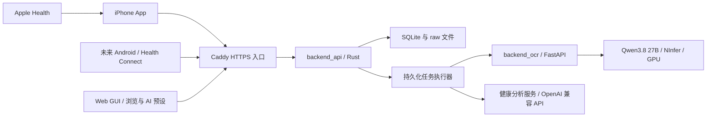

# 系统架构与部署

## 组件



用户于 2026-10-01 指定两个独立后端。backend_api 管理手机会话、SQLite、原件、任务、复核和导出；backend_ocr 只接收 API 提交的页面图像，运行 Qwen3.8 + NInfer 并返回结构化结果及完整原生回复。OCR 不访问 SQLite 或 API data。分析仍是 API 配置的独立模型接口。SQLite 只允许一个 API 服务实例，不承担多实例协调。

## 技术实施基线

- 服务端已使用 Rust、Axum、Tokio、SQLx SQLite，版本由 src/backend_api/Cargo.lock 锁定。
- iPhone 使用原生 SwiftUI、HealthKit，离线缓存与上传队列持久化。当前代码目标 iOS 17；完整 Apple SDK 构建与实际设备仍需核对。
- 客户端、服务端协议显式版本化；客户端不直接读取服务器 SQLite。
- 数据读写、领域规则、模型适配器分层，模型回复不能直接执行数据库写操作。
- 服务器统一完成单位转换、去重与聚合；客户端负责展示与审核，不维护第二套计算规则。

当前实现和验证边界见 [2026-10-02 审查](reviews/2026-10-02-server-lifecycle-and-load.md)。

## 目录计划

```text
src/backend_api/                 Rust 服务及 Cargo.toml/Cargo.lock/.cargo、当前 schema、任务与计算模块
src/ios/                    iPhone 界面、HealthKit、缓存及网络模块
src/frontend/               Web GUI 静态源文件，由 API 编译时嵌入
src/backend_ocr/             Python FastAPI 应用、NInfer 生命周期、配置、pyproject.toml/uv.lock
tests/backend_api/          镜像 backend_api 的测试结构
tests/backend_ocr/          镜像 backend_ocr 的测试结构
tests/ios/                  镜像 iOS 的测试结构
tests/frontend/             网页客户端及浏览器回归测试
docs/                       所有计划、设计与验证证据
playground/backend_api/     API 数据根：config.toml（含凭据）、SQLite、raw 等，不提交
playground/backend_ocr/     OCR 配置根：config.toml（含凭据）；只读挂载，不提交
playground/upload/          人工提供的端到端输入，不提交
playground/output/          本地运行输出，不提交
docker/                     两个组件 Dockerfile、Compose、Caddy 配置及入口
build/                      中间构建产物，不提交
dist/                       最终可运行产物，不提交
build_docker.sh              根目录 Docker 构建入口
run_playground.sh            根目录前台 Compose 运行入口
build_ios.sh                 独立 iOS 检查/构建入口
```

## TOML 配置

两个服务要求显式 `--data-dir ABSOLUTE_DIRECTORY`，只读取根内固定的 `config.toml`；TOML 不允许 data_dir 或第二配置位置。保持分节配置、强类型解析和启动校验。配置文件不存在、字段无效时启动失败；模板生成是显式操作。本项目不复制 momento 的内部模型运行布局。

| 配置节 | 主要内容 |
| --- | --- |
| server | HTTP 监听；数据根目录由 CLI 传入 |
| security | 会话时长、登录限速、受信代理 |
| storage | 上传字节与页数上限、临时文件清理策略 |
| jobs | 各类并发、租约、重试、超时 |
| ocr | url、api_key、timeout_seconds；必须连接 backend_ocr，无启停开关 |
| providers.analysis | 独立的地址、模型、内嵌 api_key、超时与能力配置 |
| analysis | 阶段 B 启用开关、触发规则 |

所有后台服务的配置凭据（API key、token、secret、password）直接内嵌到其 config.toml，不使用凭据文件或环境/CLI 覆盖。API 的 [ocr].api_key 与 OCR 的 [server].api_key 相同；可选分析凭据是 [providers.analysis].api_key，空串仅表示无鉴权接口。配置在启动边界校验，运行时不再读取密钥文件。真实配置使用 0600，不提交仓库、不进镜像或客户端，也不随业务数据 ZIP 导出；账户密码哈希与已签发会话仍保留原业务存储。首版配置重启生效，不实现动态热更新。

OCR 的模型、提示及生成参数归 backend_ocr 配置，客户端与 API 请求不能覆盖。两个服务用独立 Bearer 密钥通信，手机的用户会话不传入 OCR。probe-providers 对 OCR 只检查 /health，不加载模型；分析仍使用合成文字探测。详细配置、推理限额和协议见 [OCR 运维](runbooks/ocr.md)。

## 有界执行与临时资源

Database 持有 CpuExecutor，使用 Tokio 既有 blocking 执行器，最多两个重 CPU 任务。HTTP 请求满时返回 429；服务拥有的持久任务可以等待准入。闭包自己持有执行许可，调用方取消不会提前释放容量。Health 另有两个共享入口槽，在同步正文缓冲前取得；上传保持既有两个入口槽。Argon2 密码运算沿用独立两个槽。批次 JSON 解析、校验、摘要和 envelope 编码在 SQL 写事务前完成；大结果序列化也进入共享执行域。

TemporaryFiles 注册上传、raw 暂存、OCR scratch 与导出暂存路径。使用方持有可克隆 lease，CPU 闭包使用文件时也保留 lease；释放不做同步 Drop 删除，也不派生 detached 清理任务。既有维护周期异步清理无活跃 lease 的文件；失败保留并重试。独占 data 锁取得后，启动恢复清除中断留下的 tmp，符号链接仅删除链接。ZIP 闭包同时持有文件变更锁，避免取消请求后原件被提前删除。

停服顺序为 HTTP graceful shutdown、取消并等待持久 worker、等待已准入 CPU 闭包、临时及持久文件清理、关闭 SQLite 池。突然退出的 tmp 由下次启动恢复；原件及数据库仍依照原持久清理队列处理。

## 身份与隔离

管理员命令创建、禁用账户及重置凭据；首版无开放注册和管理员浏览健康数据界面。密码使用成熟密码哈希方案，登录发放可撤销会话，客户端凭据存在系统安全存储。

Web GUI 使用同一 Bearer API，会话仅保存在当前页面内存。网页提供浏览与服务器 AI 预设，不包含导入、复核修改或 HealthKit/Health Connect 读写。前端能力限制不改变既有会话的服务器权限。根页面及固定 assets 路由公开，数据接口继续认证；静态资源、原件和数据均不缓存。

认证中间件提供当前 user_id；客户端提交的归属不能替代认证。所有仓储查询、任务、原文件下载、同步、导出和删除都校验归属。跨资源关系使用包含 user_id 的约束，避免单凭资源 ID 关联其他用户对象。

多用户隔离不意味着服务器管理员无法读取磁盘；当前不承诺对自托管管理员的端到端加密。原文、健康值、密码与模型密钥不写入普通日志。

## 部署与文件一致性

外部客户端使用 HTTPS 到 Caddy，Caddy 转发内部 HTTP。后端端口不直接暴露公网；代理地址受控，不信任任意转发身份头。Compose 将两个服务各自的根目录挂载为 `/data`，配置和 OCR 密钥位于各自根内；Compose 同时运行 API、OCR 和 Caddy。OCR 仅在 internal inference 网络开放 8000，无宿主机端口；NInfer 仅监听 OCR 容器内 127.0.0.1:8002。OCR 故障不阻止 API 上传归档和人工复核。

CLI 的 data_dir 是 API 的持久根目录；playground 中对应 playground/backend_api。OCR 独立根为 playground/backend_ocr，只保存其配置与密钥，不保存 API 数据。实际布局如下：

```text
backend_api/
  config.toml
  database.sqlite
  raw/apple_health/<user_id>/<revision_id>.json
  raw/photos/<user_id>/<file_id>
  raw/google_health/<user_id>/<revision_id>.json
  raw/documents/<user_id>/<file_id>
  derived/<user_id>/<file_id>/input.jpg
  tmp/
  exports/<user_id>/<export_id>.zip
```

Apple Health 每个接收修订保存完整 JSON envelope；SQLite 同时保存载荷与索引。health_connect 协议来源映射到 google_health 目录，Android 客户端尚未实现。照片与 PDF 分别进 photos/documents，原文件名和 MIME 是数据库元数据。HEIC/HEIF 原字节进入 photos；JPEG 识别副本仅进入 derived。PNG/JPEG 不重新压缩；扫描器提供的每页 PNG 单独归档。原件不跨用户物理共享。

backend_ocr 的最终 HTTP 回复保存到 SQLite extraction_outputs（stage=ocr），其中包含完整 NInfer raw_response_body、正文、提示版本及结构化结果。非 2xx 和结构解析失败的已接收回复同样先归档；无响应或超过限额的内容不伪造为完整。当前 schema 只接受 ocr stage，旧 document_parser 适配与配置已移除；按用户要求不提供迁移。人工补项及每次修正保存不可变 observation_revisions，不受 HealthKit 是否能表达该字段影响。

数据库当前 schema v7 是新库定义；按空 playground 的用户要求移除历史迁移。空库初始化、v7 重启；其他版本明确拒绝启动，不自动清库。

SQLite 与文件系统不能共用一个事务：上传先写临时文件并校验，再原子移动到目标路径，最后事务提交文件记录和任务。失败产生的孤立文件由可重跑清理任务处理；接口只有全部持久化成功才返回归档接收成功。

删除先让对象不可查询并取消依赖任务，再持久化清理清单，重试删除文件，最终完成清理。不能在仍有原文件时返回“已完全删除”。运行任务提交前检查对象仍存在且版本有效。

停服复制：停止后端及所有写入者，复制整个 API 根目录（包含内嵌凭据的 config.toml 和仍存在的 SQLite sidecar），在独立目录验证恢复。OCR 根目录另行完整复制；Caddy 配置及平台管理的 TLS 证书单独保管。首版不开发在线备份功能；运行中直接复制不作为支持的备份方法。
