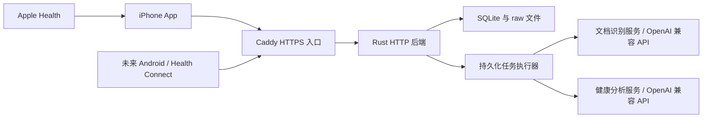

# 系统架构与部署

## 组件



三个职责不强制对应三个 Rust 进程。首版一个后端进程包含 HTTP 接口和任务执行器，OCR 与分析作为外部服务边界。选择云 API 时不需部署本地模型容器；自托管模型也不要求 Rust 实现。个人部署先只运行一个后端实例，SQLite 不承担多实例协调。

## 技术实施基线

- 服务端已使用 Rust、Axum、Tokio、SQLx SQLite，版本由 src/backend/Cargo.lock 锁定。
- iPhone 使用原生 SwiftUI、HealthKit，离线缓存与上传队列持久化。当前代码目标 iOS 17；完整 Apple SDK 构建与实际设备仍需核对。
- 客户端、服务端协议显式版本化；客户端不直接读取服务器 SQLite。
- 数据读写、领域规则、模型适配器分层，模型回复不能直接执行数据库写操作。
- 服务器统一完成单位转换、去重与聚合；客户端负责展示与审核，不维护第二套计算规则。

当前实现和验证边界见 [2026-10-01 审查](reviews/2026-10-01-raw-archive-and-skills-audit.md)。

## 目录计划

```text
src/backend/                 Rust 服务及 Cargo.toml/Cargo.lock/.cargo、当前 schema、任务与计算模块
src/ios/                    iPhone 界面、HealthKit、缓存及网络模块
tests/backend/              镜像 backend 的测试结构
tests/ios/                  镜像 iOS 的测试结构
docs/                       所有计划、设计与验证证据
playground/config.toml      本地完整运行示例，无真实密钥
playground/data/            本地服务运行数据，不提交
playground/upload/          人工提供的端到端输入，不提交
playground/output/          本地运行输出，不提交
docker/                     Dockerfile、Compose、Caddy 配置及入口
build/                      中间构建产物，不提交
dist/                       最终可运行产物，不提交
build_docker.sh              根目录 Docker 构建入口
run_playground.sh            根目录前台 Compose 运行入口
build_ios.sh                 独立 iOS 检查/构建入口
```

## TOML 配置

沿用 momento 的显式 `--config PATH`、分节配置、强类型解析、启动校验和统一 data_dir。配置文件不存在、字段无效时启动失败；模板生成是显式操作。本项目不复制 momento 的内部模型运行布局。

| 配置节 | 主要内容 |
| --- | --- |
| server | HTTP 监听、data_dir、公共入口地址 |
| security | 会话时长、登录限速、受信代理 |
| storage | 上传字节与页数上限、临时文件清理策略 |
| jobs | 各类并发、租约、重试、超时 |
| providers.ocr | base_url、model、api_key_file、适配器、图像与解码选项 |
| providers.analysis | 独立的地址、模型、密钥文件、超时与能力配置 |
| analysis | 阶段 B 启用开关、触发规则 |

配置层面的密钥引用属于 TOML，密钥文件由服务器管理员挂载，不提交仓库、不发给客户端。相对路径统一以配置文件目录为基准；解析后规范化并校验。这是 helpyourself 的明确选择，不声称 momento 已有该行为。首版配置重启生效，不实现动态热更新。

OCR 与分析允许指向相同或不同服务。能力探测使用合成内容，不擅自发送健康档案；校验视觉输入、结构化返回及 provider 特殊参数。Unlimited-OCR 使用适配器处理 PDF 页面和专用提示，不能只假定更换 model 名称即可运行。

## 身份与隔离

管理员命令创建、禁用账户及重置凭据；首版无开放注册和管理员浏览健康数据界面。密码使用成熟密码哈希方案，登录发放可撤销会话，客户端凭据存在系统安全存储。

认证中间件提供当前 user_id；客户端提交的归属不能替代认证。所有仓储查询、任务、原文件下载、同步、导出和删除都校验归属。跨资源关系使用包含 user_id 的约束，避免单凭资源 ID 关联其他用户对象。

多用户隔离不意味着服务器管理员无法读取磁盘；当前不承诺对自托管管理员的端到端加密。原文、健康值、密码与模型密钥不写入普通日志。

## 部署与文件一致性

外部客户端使用 HTTPS 到 Caddy，Caddy 转发内部 HTTP。后端端口不直接暴露公网；代理地址受控，不信任任意转发身份头。Compose 挂载配置、密钥和持久 data 目录；默认无外部推理依赖，模型容器可选。

data_dir 是 API 的持久根目录；playground 中对应 playground/data。实际布局如下：

```text
data/
  database.sqlite
  raw/apple_health/<user_id>/<revision_id>.json
  raw/photos/<user_id>/<file_id>
  raw/google_health/<user_id>/<revision_id>.json
  raw/documents/<user_id>/<file_id>
  derived/<user_id>/<file_id>/input.jpg
  tmp/
  exports/<user_id>/<export_id>.zip
```

Apple Health 每个接收修订保存完整 JSON envelope；SQLite 同时保存载荷与索引。health_connect 协议来源映射到 google_health 目录，Android 客户端尚未实现。照片与 PDF 分别进 photos/documents，原文件名和 MIME 是数据库元数据。HEIC/HEIF 原字节进入 photos；JPEG 识别副本仅进入 derived。PNG/JPEG 不重新压缩；扫描器提供的每页 PNG 单独归档。原件不跨用户物理共享。

OCR 和 document_parser 的最终 HTTP 回复分别保存到 SQLite extraction_outputs，解析失败也保留已接收回复。人工补项及每次修正保存不可变 observation_revisions，不受 HealthKit 是否能表达该字段影响。

数据库当前 schema v6 是新库定义；按空 playground 的用户要求移除历史迁移。空库初始化、v6 重启；其他版本明确拒绝启动，不自动清库。

SQLite 与文件系统不能共用一个事务：上传先写临时文件并校验，再原子移动到目标路径，最后事务提交文件记录和任务。失败产生的孤立文件由可重跑清理任务处理；接口只有全部持久化成功才返回归档接收成功。

删除先让对象不可查询并取消依赖任务，再持久化清理清单，重试删除文件，最终完成清理。不能在仍有原文件时返回“已完全删除”。运行任务提交前检查对象仍存在且版本有效。

停服复制：停止后端及所有写入者，复制整个 data 目录（若有 SQLite sidecar 文件也一并保留），在独立目录验证恢复。配置与外部模型密钥单独保管，复制 data 不等于复制部署配置。首版不开发在线备份功能；运行中直接复制不作为支持的备份方法。
