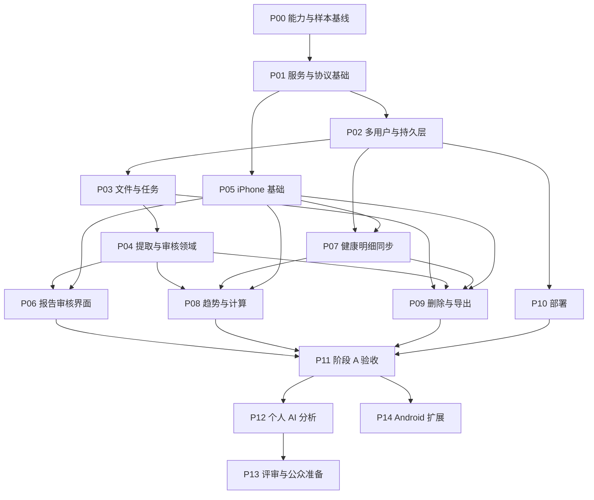

# 实施任务与依赖

2026-10-01 更新：数据库按空 playground 直接重构为 schema v6，不提供迁移；原件按来源归档，OCR 回复和人工修订完整保留，已确认血糖可显式写回 Apple Health。最新实现和 skills 缺口见 [全仓库审查](reviews/2026-10-01-raw-archive-and-skills-audit.md)。

状态：P01–P10 的首版代码已交付，P12 个人血脂分析代码默认关闭；本环境审核与自动测试见 [本轮记录](validation/phase-a-results.md)。P00/P11 的真实样本和 Apple SDK/设备证据仍缺，P13 是待执行临床/公众评审，P14 为已明确暂缓的 Android。不能凭代码存在标记全部产品验收通过。

## 依赖图

图中独立分支表示依赖关系，不表示本次已安排并行代理或自动开始实现。

## P00 — 能力与真实样本基线

- 核实 Mac/Xcode、签名与用户 iPhone 的系统版本；当前仓库所在环境不预设能构建 iOS。
- 建立私人样本位置与人工核对模板；收集用户实际提供的 PDF、图片和至少可用的历史记录，不假造已有数量。
- 用 Unlimited-OCR 或用户配置模型测页识别、结构化输出和定位，记录推理资源、耗时、漏项、数值/单位错配。
- 真机检查 HealthKit：基础数量、分类、运动、变更/删除、重扫、权限未知和后台行为。
- 输出 `docs/validation/capability-baseline.md` 与数据类型支持矩阵。没有真实样本时可继续搭基础，但准确性关口保持未通过。
- 完成标准：开发条件明确、模型适配路径证实、首轮平台类型及尚未支持类型列明。

## P01 — 服务骨架、配置与协议

- 建立标准 src/tests 结构、Rust 构建、显式 TOML 加载、配置模板生成、启动校验及 HTTP 应用工厂。
- 定义认证上下文、统一错误、资源版本、分页与接口规格；iOS 使用共享契约，避免两端字段漂移。
- 配置分离 OCR 与 analysis provider，分析默认关闭；合成输入能力检查不上传真实健康数据。
- 完成标准：合法配置可启动，无效配置明确失败；示例不含密钥；构建输出只进 build/dist。

## P02 — 多用户与持久层

- SQLite 当前 schema 初始化、用户与会话、管理员建号/禁用/重置；用户归属贯穿对象、关系、查询与文件接口。
- 创建报告、修订、健康记录、批次及任务的基础表和索引；启用并验证外键。
- 明确单实例写入、事务边界和繁忙重试；不在长事务内调用模型。
- 完成标准：两个账户的列表、按 ID 读取、关联创建、任务与导出均不能互访；空库初始化与当前版本重启安全；旧 schema 明确拒绝，不做迁移。

## P03 — 原文件与任务执行

- 流式接收 PDF/图片，内容校验、大小/页数限制、摘要和归档一致性。
- SQLite 持久任务、租约、有限退避、手动重试、页级进度、取消与孤立文件清理。
- 完成标准：上传重放无重复；崩溃后任务恢复；关闭 App 不取消已接收工作；坏文件可解释失败。

## P04 — 提取、标准化与审核领域

- OCR 适配器、分页输入、结构化候选校验与原文定位，记录 provider/规则版本。
- 指标字典、单位转换注册表与未映射状态；支持文本、范围、比较符及人工补项。
- 部分确认、修订冲突、重复候选与修订报告关系；审核规则在服务器实现。
- 完成标准：真实样本逐字段核对；未确认不入趋势；重新提取不能覆盖人工修正。

## P05 — iPhone 基础

- 原生项目、服务器地址与登录、会话安全存储、网络错误处理、缓存与待上传队列。
- 档案/趋势/同步/设置框架，退出及账户切换的缓存隔离。
- 完成标准：真机连接 Caddy HTTPS；断网仍可看已缓存数据和时间；待上传不跨账户发送。

## P06 — 报告审核界面

- 文件与照片选择、上传进度、任务详情、原文与候选对照、改值/补项/拒绝/部分确认。
- 页级失败、未解析内容、重复确认、修订历史和可选检查背景。
- 完成标准：PDF 与照片各有完整真机闭环；用户能纠正错误并从已确认结果回到原报告。

## P07 — 健康明细同步

- 手机按类型适配与持久批次，服务器幂等接收、删除事件和来源去重；回执后推进游标。
- 当前目录覆盖可用数量/分类/临床/组合类型，加入 ECG、心跳、路线、数量序列及特征/活动环/CDA/药物快照；实际 SDK 与真机支持以当前矩阵为准。
- 可读样本 secure archive 与全部载荷进入 SQLite 和来源 raw 目录；限额或查询失败不能推进锚点或用总量替代明细。
- 完成标准：响应丢失、断线、重扫、多设备、删除和权限未知场景通过；支持矩阵列出数据粒度和限制。
- 阶段 A 验收锁定首轮真实支持列表；“所有可读取类型”的长期目标继续以未完成工作跟踪。

## P08 — 趋势与服务端计算

- 血检趋势、逐点参考区间、独立多指标尺度、出处跳转。
- 平台去重视图、按时区聚合、版本与覆盖元数据；按类型定义算法，不实现泛化的任意求平均。
- 大量明细索引与分页；根据真实数据测量后再决定缓存。
- 完成标准：服务端结果与人工基准一致，空值不等于零，跨日/夏令时和来源重叠不重复计数。

## P09 — 删除、导出与本地清理

- 报告/账户异步清理、任务取消、分析失效机制、同步删除抑制与迟到结果拒绝。
- 版本化 JSON 清单、原文件、修订、出处、辅助 CSV；生成与下载都鉴权。
- 完成标准：删除任务重试可完成、无用户可访问残留或后台复活；导出字段与文件数量核对完整。

## P10 — Compose 与运行文档

- docker 下创建镜像、Compose、Caddy 与配置挂载；私有后端 HTTP，不暴露数据库或 raw 文件目录。
- 配置示例、管理员建号、启动/升级/停服复制/独立恢复说明；不做自动备份系统。
- 完成标准：空数据目录启动、持久卷重启、HTTPS 真机访问及停服复制恢复通过。

## P11 — 阶段 A 集成验收

- 使用真实经授权样本完成 PDF/照片 → 修正 → 部分/完全确认 → 趋势 → 原文 → 导出的闭环。
- 执行跨用户、同步、重复、删除、任务故障用例；记录实际支持范围和准确性指标。
- 输出 `docs/validation/phase-a-results.md`，列明未验证内容，不用模拟器代替全部真机验证。
- 完成标准：validation.md 的阶段 A 阻断项清零；只有模型识别展示不算交付。

## P12 — 个人 AI 风险分析

- 先定义首个血脂场景的可用数据、医学资料与评审样例，不直接让模型扫描全部原档案下结论。
- 分析快照、计算版本、经核验来源、证据引用校验、缺失信息与假设结构。
- 手动/新确认触发、合并排队、同一问题历史、模型失败状态、反馈与删除失效。
- 完成标准：每条数据引用存在、来源可核验、过期输入不标当前、无证据不发布假设；先个人试用无持续推送。

## P13 — 临床评审与公众准备

- 建立临床评审案例集和预先定义的漏报、误报及建议恰当性评价；评审者与样本获取待安排。
- 根据届时具体用途、宣传、数据流和发布方式调查美国法规及应用商店要求；此文档不判定合规或豁免。
- 再决定公众发布、托管运营、支持和事件响应范围。未通过评审不把个人试用结果视为公众发布资格。

## P14 — Android 与后续范围

- Health Connect 可用性、权限及类型差异实测，接入同一档案与计算协议；跨平台删除与去重独立验收。
- Android、扩展平台写回映射、Excel、直连设备服务、网页端、持续通知分别立项，不默认为第一版任务。

## 当前验收交接

本环境已完成实现、代码审核及可运行测试。剩余条件是 Mac/Xcode 与签名真机、用户授权的真实 PDF/照片、明确模型端点以及临床评审者。按 [iPhone 指南](runbooks/ios.md)和 [验收记录](validation/phase-a-results.md)执行外部验证；阶段 A 通过后再启用个人分析，Android/公众发布保持后续范围。
